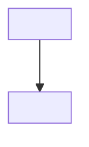

## TL;DR

- <3-5 viñetas con lo esencial. Una idea por viñeta, frases cortas.>

## Conceptos clave

**<Concepto 1>**: <explicación corta, una o dos frases.>

**<Concepto 2>** (*<término inglés si procede>*): <explicación corta.>

## Explicación

### <Subtítulo propio 1>

<Contenido traducido y condensado. Reorganizado por ideas, no párrafo a párrafo.
Los términos técnicos habituales en inglés se mantienen en inglés; la primera vez que
aparecen se acompañan de una explicación breve en español.>

```<lenguaje>
// Código del original, íntegro. Solo se traducen los comentarios.
```

> **Nota:** <solo si se añade contexto que no está en el original.>

### <Subtítulo propio 2>

<…>

## Esquema



| <Columna> | <Columna> |
| --- | --- |
| <…> | <…> |

## Glosario

- **<Término en inglés>**: <explicación en español.>

## Preguntas de repaso

1. <Pregunta 1>

   <details>
   <summary>Ver respuesta</summary>

   <Respuesta basada solo en el contenido del apunte.>

   </details>

2. <Pregunta 2>

   <details>
   <summary>Ver respuesta</summary>

   <Respuesta.>

   </details>
