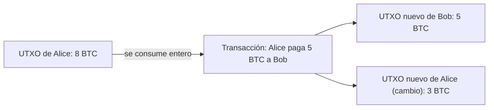

## TL;DR

- En web2 un servidor central guarda los saldos. En una red descentralizada hace falta un **modelo** concreto para registrarlos.
- Una transacción necesita **cantidad, pagador, receptor y autorización del pagador** (la firma digital), y su propósito es **cambiar el estado**.
- **Modelo de cuentas** (Ethereum y cadenas EVM): cada cuenta guarda solo su saldo total, como en un banco.
- **Modelo UTXO** (Bitcoin): el saldo es la suma de salidas de transacciones sin gastar. Cada UTXO se gasta entero una sola vez y el sobrante vuelve como cambio en un UTXO nuevo.
- Elegir modelo es una cuestión de compromisos: Ethereum necesita flexibilidad para mucho estado; Bitcoin busca ser simple y sin estado.

## Conceptos clave

**Transacción** (*transaction*): operación que cambia el estado de los usuarios. En ella empiezan los saldos.

**Modelo de cuentas** (*account-based model*): registra solo el saldo total de cada cuenta, sin guardar de qué se compone.

**UTXO** (*Unspent Transaction Output*): salida de una transacción que todavía no se ha gastado. En Bitcoin, el saldo de un usuario es el conjunto de sus UTXOs.

**Cambio** (*change*): lo que sobra al consumir un UTXO; se devuelve en forma de UTXOs nuevos.

**Bitcoin Script**: código fijo asociado a cada UTXO con las condiciones para desbloquearlo y gastarlo.

**Estado** (*state*): situación actual de los usuarios, por ejemplo sus saldos, que las transacciones van modificando.

## Explicación

### El problema de guardar saldos sin servidor central

En las plataformas web2 basadas en servidor es fácil llevar los datos de los usuarios: un único servidor centralizado guarda el estado de las cuentas, así que no hace falta consenso ni resolver discrepancias.

En un sistema descentralizado, en cambio, guardar los saldos se complica, y redes como Bitcoin y Ethereum necesitan un modelo concreto para ello:

- **Bitcoin** usa el **modelo UTXO**.
- **Ethereum** y las demás cadenas **EVM** (compatibles con la máquina virtual de Ethereum) usan el **modelo de cuentas**.

Estudiar UTXO, aunque Ethereum no lo use, ayuda a entender los compromisos de diseño de cada modelo de almacenamiento.

### Qué necesita una transacción

Los saldos empiezan en las transacciones. Una transacción necesita:

1. **Cantidad** (*amount*): lo que se envía.
2. **Pagador** (*payer*): quien envía.
3. **Receptor** (*payee*): quien recibe.
4. **Autorización del pagador** (*payer authorization*): una autorización imposible de falsificar dada por quien inicia la transacción. Es la **firma digital**, que solo se puede generar con la clave privada del usuario. Sin ella no hay pago posible, salvo «romper» la criptografía, algo prácticamente imposible.

> La firma digital se explica en [Public Key Cryptography](/alchemy-ethereum/criptografia/01-public-key-cryptography/).

> **Nota:** el original describe la firma digital como «básicamente un hash». Es más exacto decir que se genera con la clave privada (como se ve en el apunte enlazado); los hashes intervienen en el proceso, pero una firma no es un hash.

El **propósito** de una transacción es **cambiar el estado** de los usuarios. Si Alice envía 5 DAI a Bob, el saldo de Alice baja 5 y el de Bob sube 5. Las blockchains suelen ser redes basadas en transacciones, y tanto Bitcoin como Ethereum (y los bancos) registran los saldos a partir de ellas.

### Modelo de cuentas

Es el modelo de cualquier cuenta bancaria: se guarda el **estado global de cada cuenta**, sin registrar de qué se compone el saldo. Una entrada del registro sería:

```text
Acct #12345 -> Name: Rick Sanchez -> Balance: $142.62
```

Solo hay una cifra. No se registra que esos 142,62 $ sean un billete de 100, uno de 20, dos de 10 y varias monedas. Cuando Rick saca dinero de un cajero, recibe los billetes y monedas que el banco tenga a mano, no los mismos con los que se formó su saldo.

Una transacción en este modelo:

1. Alice tiene un saldo de 60 $ y Bob de 20 $.
2. Bob envía 5 $ a Alice.
3. Se restan 5 $ del saldo de Bob. Si el saldo restante es mayor que 0 se continúa; si no, la transacción se revierte (*revert*).
4. Se suman 5 $ al saldo de Alice.
5. Se actualizan los saldos totales en ambos extremos del registro, y ahí termina la transacción.

### Modelo UTXO

El modelo UTXO es bastante distinto y algo más complejo, sobre todo porque no se parece a nada que usemos en el día a día.

Si Alice envía 5 BTC a Bob, la transacción se difunde a la red. Si es válida (Alice tiene más de 5 BTC, posee las claves privadas y puede firmar), Alice está expresando su intención de cambiar el estado. Cuando la red mina la transacción, **Bob recibe un UTXO de 5 BTC**. Bitcoin lleva los saldos así: con un conjunto enorme de UTXOs, las salidas de transacciones que abonan a los usuarios una cantidad de BTC.

Por eso, en lugar de decir «tengo 3 bitcoins», lo correcto sería «tengo varios UTXOs que me permiten gastar 3 bitcoins».

Propiedades de los UTXOs:

- Son **no fungibles**: cada uno es distinto de los demás. El curso bromea con que Bitcoin fue la primera colección de NFTs.
- Para gastar un UTXO hay que **referirse a ese UTXO concreto**.
- Los UTXOs de un usuario están **repartidos por muchos bloques**.
- Cuando se **consume** un UTXO, lo que sobra de la transacción genera **UTXOs nuevos** con el cambio.
- Un UTXO (a menudo llamado *coin*) solo se puede gastar **una vez**, así que no hay doble gasto.
- En Bitcoin, cada UTXO lleva asociado un **script**: código fijo con las condiciones para desbloquearlo y volver a gastarlo (**Bitcoin Script**).

## Esquema

Gasto de un UTXO con cambio (ilustración con cifras de ejemplo):



> **Nota:** las cifras de este diagrama son un ejemplo propio para ilustrar la regla del cambio; en Bitcoin real, además, parte suele ir a comisiones, algo que el original no trata.

Cómo se expresa un saldo (sustituye al meme `drake` del original):

| ❌ Menos exacto | ✅ Más exacto |
| --- | --- |
| «Tengo 3 bitcoins» | «Tengo varios UTXOs que me permiten gastar 3 bitcoins» |

Modelo de cuentas frente a UTXO:

| | Cuentas | UTXOs |
| --- | --- | --- |
| Quién lo usa | Ethereum y cadenas EVM, bancos | Bitcoin |
| Saldos | Estado global de la cuenta (p. ej. Alice tiene 4,2 ETH) | UTXOs concretos (p. ej. Alice tiene 29 UTXOs que suman 2,65 BTC) |
| Ventajas | Más intuitivo, fácil de entender | Muy buena privacidad si el usuario usa una dirección nueva en cada transacción |
| Inconvenientes | Ataques de repetición (*replay attacks*) | Los UTXOs no tienen estado, lo que complica los diseños con mucho estado |
| Filosofía | Flexibilidad para gestionar muchas piezas de estado | Red lo más simple y sin estado posible |

> **Nota:** en el original, el inconveniente del modelo de cuentas está cortado («someone could re-»). Por el nombre, un *replay attack* consiste en que alguien reenvíe una transacción ya firmada para que se ejecute otra vez; el curso no llega a explicarlo.

## Glosario

- **EVM** (*Ethereum Virtual Machine*): máquina virtual de Ethereum; las cadenas EVM son las compatibles con ella.
- **Payer / payee**: quien paga y quien recibe en una transacción.
- **State**: situación actual de los usuarios (saldos, etc.) que las transacciones modifican.
- **Account-based model**: modelo que registra solo el saldo total de cada cuenta.
- **UTXO** (*Unspent Transaction Output*): salida de transacción aún sin gastar.
- **Revert**: deshacer una transacción que no se puede completar.
- **Non-fungible**: que no es intercambiable por otro igual; cada unidad es única.
- **Change**: sobrante de un UTXO consumido, devuelto como UTXO nuevo.
- **Coin**: nombre habitual de un UTXO.
- **Bitcoin Script**: lenguaje de los scripts que definen cómo se desbloquea cada UTXO.
- **Replay attack**: ataque que consiste en reenviar una transacción válida para repetirla.
- **Stateless**: sin estado.

## Preguntas de repaso

1. ¿Qué cuatro elementos necesita una transacción en una blockchain?

   <details>
   <summary>Ver respuesta</summary>

   Cantidad, pagador, receptor y la autorización del pagador, es decir, su firma digital generada con la clave privada.

   </details>

2. ¿Qué información guarda el modelo de cuentas sobre un saldo?

   <details>
   <summary>Ver respuesta</summary>

   Solo el saldo total de la cuenta, sin registrar de qué se compone.

   </details>

3. ¿Qué pasa con lo que sobra al gastar un UTXO?

   <details>
   <summary>Ver respuesta</summary>

   El UTXO se consume entero y lo que sobra genera UTXOs nuevos con el cambio.

   </details>

4. ¿Cuál es la principal ventaja del modelo UTXO y su principal inconveniente?

   <details>
   <summary>Ver respuesta</summary>

   Ventaja: muy buena privacidad si se usa una dirección nueva en cada transacción. Inconveniente: los UTXOs no tienen estado, lo que complica los diseños con mucho estado.

   </details>

5. ¿Por qué Ethereum usa el modelo de cuentas y Bitcoin el de UTXOs?

   <details>
   <summary>Ver respuesta</summary>

   Ethereum necesita transacciones flexibles para gestionar muchas piezas de estado. Bitcoin está diseñado a propósito para ser lo más simple y sin estado posible.

   </details>
