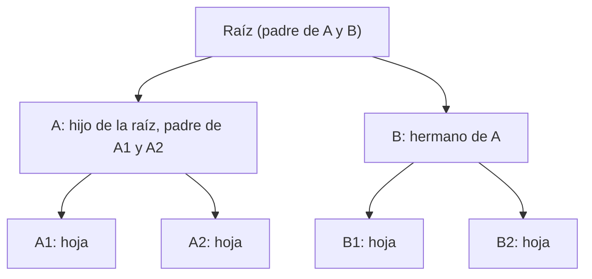
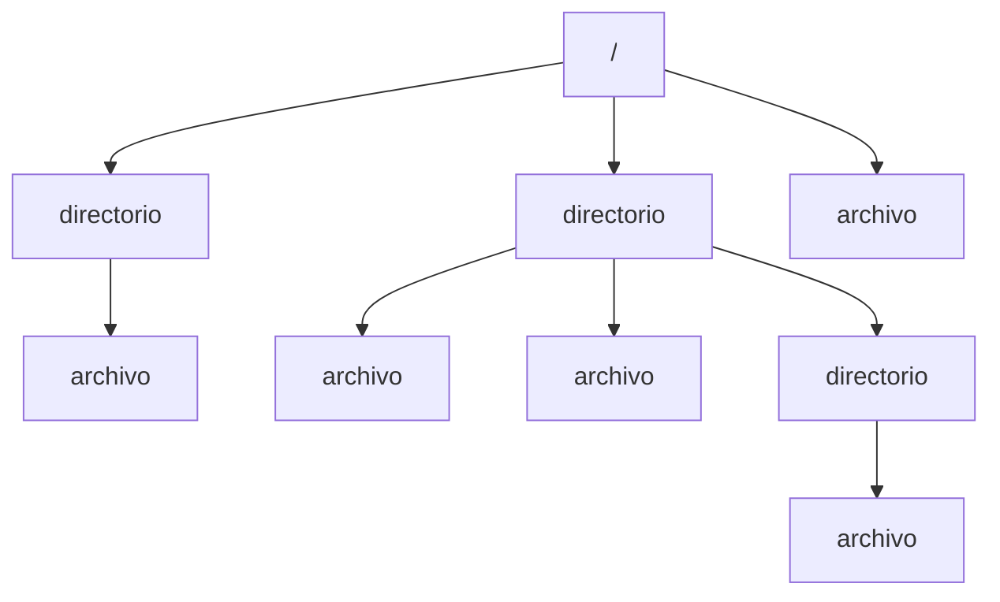
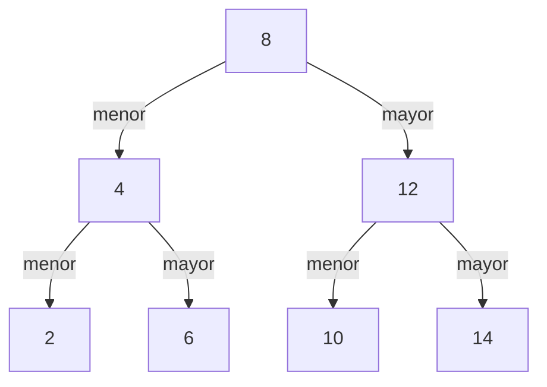

## TL;DR

- Las blockchains usan mucho los **árboles** para guardar el estado, que cambia constantemente. Los informáticos los dibujan al revés, con la raíz arriba.
- Un árbol puede tener cualquier número de hijos por nodo. La palabra que va delante de «tree» (*binary*, *binary search*…) indica qué reglas impone.
- **Árbol binario**: cada padre tiene como mucho dos hijos. **Árbol binario de búsqueda (BST)**: además, a la izquierda van las claves menores y a la derecha las mayores.
- En un BST, añadir un nivel entero de datos solo añade un intento de búsqueda: la búsqueda es **O(log n)**.
- En blockchain importa elegir estructuras eficientes (poco almacenamiento, búsqueda rápida), lo más cerca posible del **tiempo constante**.

## Conceptos clave

**Nodo** (*node*): unidad básica de una estructura de datos. Aquí no hay que confundirlo con los nodos de una red peer-to-peer; depende del contexto.

**Árbol** (*tree*): estructura jerárquica en la que cada padre puede tener cualquier número de hijos.

**Árbol binario** (*binary tree*): árbol en el que cada padre tiene como máximo dos hijos.

**Árbol binario de búsqueda** (*binary search tree*, BST): árbol binario en el que el subárbol izquierdo de cada nodo solo tiene claves menores y el derecho solo mayores.

**Hoja** (*leaf*): nodo del último nivel, sin hijos.

**Subárbol** (*subtree*): parte de un árbol que, aislada, forma un árbol nuevo con sus propias relaciones.

**Big O**: notación que indica aproximadamente cómo rinde un algoritmo en función de *n*, el número de elementos de entrada.

## Explicación

### Por qué árboles

Las redes blockchain usan transacciones para cambiar el estado y llevar los saldos (ver [UTXO & Account Models](/alchemy-ethereum/blockchain-storage/01-utxo-account-models/)). El siguiente paso es ver con qué **estructuras de datos** guardan ese estado, y la respuesta son sobre todo árboles. En informática se dibujan **al revés**, con la raíz arriba y las hojas abajo.

### Vocabulario de los árboles

- **Nodo** (*node*): unidad básica de la estructura.
- **Padre** (*parent*) e **hijos** (*children*): un nodo es padre de los que cuelgan directamente de él. Es una relación **relativa**: una hoja pasa a ser padre en cuanto se le añade un hijo.
- **Hojas** (*leaves*): nodos del último nivel, sin hijos.
- **Clave** (*key*): el dato que guarda el nodo.
- **Raíz** (*root*): el nodo superior, el «más padre» de todos.
- **Hermanos** (*siblings*): nodos con el mismo padre y en el mismo nivel.
- **Subárbol** (*subtree*): una parte del árbol que, aislada, forma un árbol nuevo con sus propias relaciones.
- **Altura** (*height*): número de niveles del árbol.

### Tipos de árbol: las reglas que impone el nombre

Un árbol no tiene por qué seguir ninguna regla: puede ser cualquier padre con cualquier número de hijos. Pero lo habitual es que delante de «tree» vaya una palabra que diga **qué reglas impone**. Conocer esas reglas permite trabajar con los datos de forma más eficiente.

- **Árbol binario**: cada padre tiene **como mucho dos hijos**.
- **Árbol binario de búsqueda (BST)** es más estricto y cumple cuatro reglas:
  1. Es un árbol binario.
  2. El subárbol **izquierdo** de un nodo solo contiene claves **menores** que la suya.
  3. El subárbol **derecho** solo contiene claves **mayores**.
  4. Los subárboles izquierdo y derecho de cada nodo también son BST.

### Árbol frente a lista enlazada

Una **lista enlazada** (*linked list*) también es un árbol: uno muy largo en el que cada padre tiene un único hijo, formando una cadena continua. Pero un árbol no tiene por qué ser una lista enlazada. La diferencia se ve en el código:

```js
class LinkedListNode {
    constructor(data) {
        this.data = data;
        this.next = null;
    }
}

class TreeNode {
    constructor(data) {
        this.data = data;
        this.children = [];
    }
}
```

`TreeNode` guarda el dato y un array con las referencias a todos sus hijos, mientras que `LinkedListNode` solo guarda una referencia al siguiente nodo (`next`).

### Cuándo usar un árbol

Hay árboles que aparecen de forma natural, como un **sistema de archivos**, en el que cada directorio puede tener cualquier número de hijos. Conviene usar un árbol cuando:

- Los datos se pueden organizar **de forma jerárquica**.
- Hay que **buscar y ordenar** datos de forma eficiente, precisamente gracias a las reglas que impone (binario, BST…).
- Se van a usar **algoritmos recursivos**, que suelen ir de la mano de los árboles.

### Búsqueda en un BST y Big O

Como en un BST cada hijo izquierdo es menor que su padre y cada hijo derecho es mayor, para buscar una clave basta con bajar un nivel en cada paso. El número máximo de intentos es la **altura** del árbol.

En un BST completo, el número de nodos se duplica en cada nivel. Con altura 3, el último nivel tiene 4 nodos, y el siguiente tendría como mucho 8. Aunque se añada un nivel entero de datos, la búsqueda solo necesita **un intento más**. Es decir, aunque el tamaño del árbol crezca de forma exponencial, el tiempo de búsqueda sigue siendo **O(log n)**, donde *n* es el número de nodos.

La **notación Big O** indica aproximadamente cómo rinde un algoritmo en función de *n*. Como las blockchains son básicamente bases de datos, este análisis es clave para elegir la estructura más eficiente (bajo coste de almacenamiento, búsqueda y recuperación sencillas). Lo ideal es acercarse lo más posible al **tiempo constante**, O(1).

Estos conceptos son la base de los árboles más específicos que usan las blockchains, empezando por los **Merkle trees**.

## Esquema

Vocabulario sobre un árbol binario (sustituye a las imágenes `simple-tree` y `tree-vocab` del original):



A, A1 y A2 forman un **subárbol** con raíz en A.

Un árbol sin reglas, como un sistema de archivos (sustituye a `weird-tree` y `file-system`):



BST de altura 3 (sustituye a `figure-d`):



> **Nota:** los nombres del sistema de archivos y las claves del BST son un ejemplo propio; las imágenes originales no estaban disponibles. En este BST, buscar cualquier clave requiere como mucho 3 intentos, uno por nivel.

| Estructura | Regla | Búsqueda |
| --- | --- | --- |
| Árbol | Ninguna: cualquier número de hijos | Depende del árbol |
| Lista enlazada | Un único hijo por nodo (`next`) | — |
| Árbol binario | Como mucho 2 hijos por nodo | — |
| Árbol binario de búsqueda | Binario + menores a la izquierda, mayores a la derecha | O(log n) |

## Glosario

- **Node**: unidad básica de una estructura de datos.
- **Parent / child**: relación entre un nodo y los que cuelgan directamente de él.
- **Leaf**: nodo sin hijos, del último nivel.
- **Key**: dato guardado en un nodo.
- **Root**: nodo superior del árbol.
- **Siblings**: nodos con el mismo padre y del mismo nivel.
- **Subtree**: parte de un árbol que forma un árbol por sí misma.
- **Height**: número de niveles de un árbol.
- **Binary tree**: árbol con como mucho dos hijos por nodo.
- **Binary search tree (BST)**: árbol binario ordenado (menores a la izquierda, mayores a la derecha).
- **Linked list**: cadena de nodos en la que cada uno apunta solo al siguiente.
- **Big O notation**: notación que describe cómo crece el coste de un algoritmo según el tamaño de la entrada.
- **Constant time**: O(1), coste que no depende del tamaño de la entrada.

## Preguntas de repaso

1. ¿Qué indica la palabra que va delante de «tree» (por ejemplo, *binary*)?

   <details>
   <summary>Ver respuesta</summary>

   Las reglas que impone ese árbol. Por ejemplo, *binary* significa que cada padre tiene como mucho dos hijos.

   </details>

2. ¿En qué se diferencia un `TreeNode` de un `LinkedListNode`?

   <details>
   <summary>Ver respuesta</summary>

   `TreeNode` guarda un array `children` con referencias a todos sus hijos, mientras que `LinkedListNode` solo guarda una referencia `next` al siguiente nodo. Una lista enlazada es un árbol con un único hijo por padre.

   </details>

3. ¿Qué reglas cumple un árbol binario de búsqueda?

   <details>
   <summary>Ver respuesta</summary>

   Es binario, el subárbol izquierdo de cada nodo solo tiene claves menores, el derecho solo mayores, y ambos subárboles también son BST.

   </details>

4. ¿Cuánto aumenta el tiempo de búsqueda en un BST si se añade un nivel entero de nodos?

   <details>
   <summary>Ver respuesta</summary>

   Solo un intento más. Por eso la búsqueda es O(log n), aunque el número de nodos crezca de forma exponencial.

   </details>

5. ¿Por qué importa el análisis Big O al diseñar una blockchain?

   <details>
   <summary>Ver respuesta</summary>

   Porque una blockchain es básicamente una base de datos y hay que elegir estructuras eficientes (poco almacenamiento, búsqueda y recuperación sencillas), lo más cerca posible del tiempo constante.

   </details>
