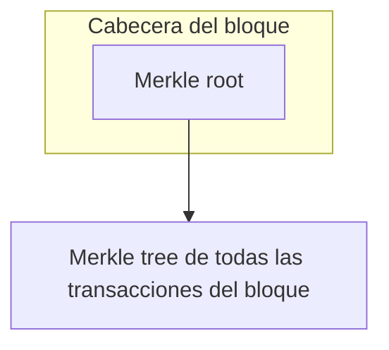
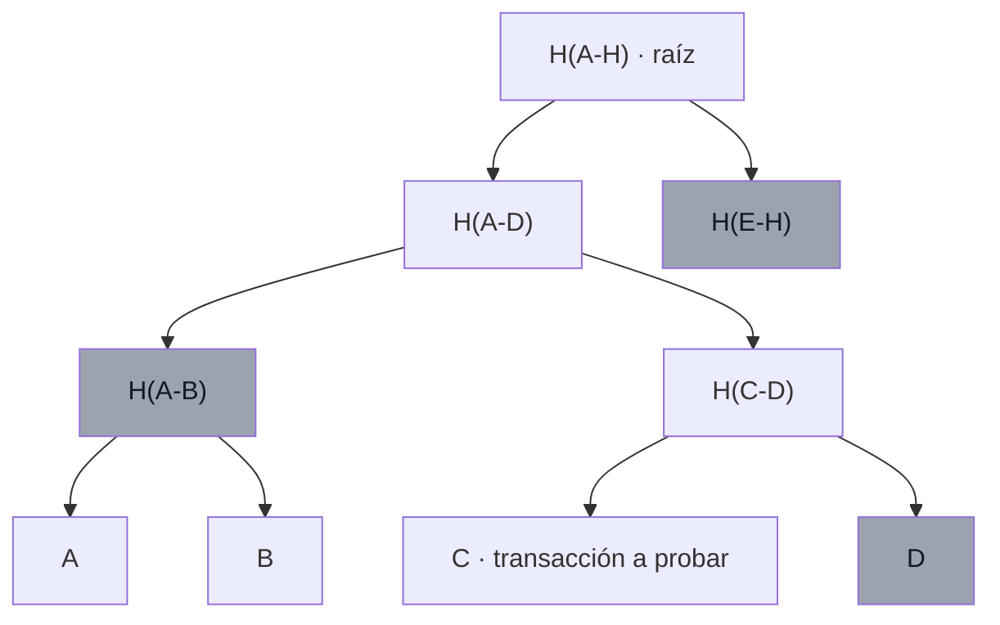

> El vocabulario básico de árboles (raíz, hoja, subárbol…) está en [Tree Data Structures](/alchemy-ethereum/blockchain-storage/02-tree-data-structures/).

## TL;DR

- Un **Merkle tree** organiza las transacciones de un bloque en un árbol de hashes. En la cabecera del bloque solo se guarda el hash raíz, la **Merkle root**.
- Guardar un único hash en lugar de miles de transacciones mantiene la cadena pequeña, lo que permite que más gente ejecute nodos completos y favorece la descentralización.
- Una **Merkle proof** demuestra que una transacción está en el bloque aportando solo unos pocos hashes, lo justo para reconstruir la raíz.
- El número de piezas de la prueba crece de forma **logarítmica** con el número de datos.
- Permiten la **SPV**: verificar una transacción sin descargar el bloque ni la cadena, que es lo que hacen los monederos (*light clients*).

## Conceptos clave

**Merkle tree**: estructura de datos para validar datos. Se hashean los datos por parejas de forma recursiva hasta llegar a un único hash.

**Merkle root**: hash raíz del Merkle tree. Va en la cabecera del bloque y se deriva de los hashes de todas sus transacciones.

**Merkle path**: los hashes que necesita un usuario para calcular la Merkle root partiendo del hash de su propia transacción.

**Merkle proof**: prueba de que una transacción concreta está en un bloque concreto sin examinar todas las transacciones. Incluye la Merkle root y el Merkle path.

**SPV** (*Simple Payment Verification*): verificación de una transacción sin descargar el bloque ni la blockchain entera.

**Prover y verifier**: quien calcula la Merkle root y quien comprueba que un valor está en el árbol sin conocer todos los valores.

## Explicación

### Merkle trees en Bitcoin

Los Merkle trees son muy eficientes para verificar datos, y Bitcoin los usa para guardar las transacciones de cada bloque. Todas las transacciones de un bloque se organizan en un gran Merkle tree, y lo que queda **comprometido** (*committed*) en el bloque, y por tanto en la cadena inmutable, es el **hash raíz** de ese árbol.

Así, en lugar de miles de transacciones basta con comprometer un único dato. Los datos de las transacciones pueden guardarse fuera de la cadena: los nodos completos (*full nodes*), por ejemplo, las guardan en una base de datos **LevelDB** integrada.

> **Nota:** en Bitcoin, las transacciones sí viajan en el cuerpo del bloque. Lo que lleva la **cabecera** (la parte que se encadena y se hashea en la proof-of-work) es solo la Merkle root. Además, Bitcoin Core guarda los bloques en ficheros propios y usa LevelDB sobre todo para índices y para el conjunto de UTXOs.

El objetivo de diseño es mantener la blockchain **lo más pequeña posible**. Una blockchain crece sin parar, y si no se hincha, más gente puede permitirse ejecutar un nodo completo, lo que ayuda a la **descentralización** de la red.

### Merkle proofs

El Merkle tree es un algoritmo **recursivo basado en hashes**, y eso permite demostrar de forma eficiente que un dato forma parte de la raíz. Una **Merkle proof** confirma que ciertas transacciones, representadas por el hash de una hoja o de una rama, están dentro de una Merkle root. Para demostrar que una transacción estuvo en la blockchain en un momento dado, basta con presentar su Merkle proof.

Ejemplo con 8 transacciones (A-H): para demostrar que **C** está en el bloque solo hacen falta **3 datos**: `D`, `H(A-B)` y `H(E-H)`. Con ellos se reconstruye la raíz `H(A-H)`. Si la raíz que obtienes coincide, queda probado que la transacción formaba parte del árbol en ese momento. En un árbol tan pequeño no parece mucho ahorro, pero con más de 10 000 transacciones la diferencia es enorme.

### Prover y verifier

- **Prover**: hace todos los cálculos para crear la Merkle root, que no es más que un hash.
- **Verifier**: no necesita conocer todos los valores para saber con certeza que uno de ellos está en el árbol.

El gran beneficiado es el verifier. O la prueba reconstruye la raíz, y el dato queda verificado, o no la reconstruye, y entonces el dato no estaba cuando se calculó la raíz (o el cálculo está mal).

### Para qué sirven

- Son eficientes en **espacio y en cálculo**.
- Favorecen la **escalabilidad y la descentralización**: no hace falta llenar el bloque de transacciones, basta con comprometer la Merkle root y guardar las transacciones donde se puedan gestionar.
- Reducen mucho la **memoria** necesaria para verificar que los datos no se han alterado.
- Hay que **difundir menos datos** por la red para verificar datos y transacciones.
- Permiten la **SPV**, con la que se pueden enviar y recibir transacciones desde un **light client** (nodo ligero), más conocido como monedero o *crypto wallet*.

### Escalado logarítmico

El número de piezas que necesita una prueba crece de forma **logarítmica** con el número de datos que entran en el árbol.

### Por qué importa al programar

Mantener el almacenamiento ligero y eficiente es la razón de ser de estructuras como los Merkle trees, y conviene tenerlo en mente al construir **dApps**: en Ethereum, cuanto menos eficiente sea el uso del almacenamiento, más caro será el programa para ti y para tus usuarios. La siguiente estructura del tema son los **Patricia Merkle Tries**, muy usados en Ethereum.

## Esquema

Qué guarda el bloque (sustituye a las imágenes `btc-block-arch` y `my-image` del original):

Merkle proof de la transacción C (sustituye a `tree4`). En gris, los datos de la prueba:

Reconstrucción de la raíz: `H(C + D)` → `H(C-D)`; `H(H(A-B) + H(C-D))` → `H(A-D)`; `H(H(A-D) + H(E-H))` → `H(A-H)`.

Escalado logarítmico (sustituye a la imagen `log`):

| Transacciones en el árbol | Piezas de la prueba |
| --- | --- |
| 8 | 3 |
| 16 | 4 |
| 1 024 | 10 |
| 10 000 | ~14 |

> **Nota:** las cifras de la tabla son un cálculo propio para un árbol binario (log₂ n, redondeado hacia arriba); el original solo dice que el crecimiento es logarítmico.

## Glosario

- **Merkle tree**: árbol de hashes que resume un conjunto de datos en un único hash.
- **Merkle root**: hash raíz del Merkle tree, guardado en la cabecera del bloque.
- **Merkle path**: hashes necesarios para llegar desde la hoja propia hasta la raíz.
- **Merkle proof**: Merkle root + Merkle path; prueba que una transacción está en un bloque.
- **Commit**: fijar un dato en el bloque, y por tanto en la cadena inmutable.
- **Off-chain**: fuera de la cadena.
- **Full node**: nodo que guarda y valida la cadena completa.
- **LevelDB**: base de datos clave-valor que usan los nodos completos.
- **SPV** (*Simple Payment Verification*): verificar un pago sin descargar el bloque ni la cadena.
- **Light client**: nodo ligero que no guarda la cadena completa; por ejemplo, un monedero.
- **Prover / Verifier**: quien genera la prueba y quien la comprueba.
- **dApp**: aplicación descentralizada.

## Preguntas de repaso

1. ¿Qué se guarda en la cabecera de un bloque de Bitcoin para representar sus transacciones?

   

   
Ver respuesta

   La Merkle root, el hash raíz del Merkle tree formado con todas las transacciones del bloque.

   

2. ¿Por qué ayudan los Merkle trees a la descentralización?

   

   
Ver respuesta

   Porque mantienen la blockchain pequeña, y así más gente puede permitirse ejecutar un nodo completo.

   

3. En un árbol de 8 transacciones (A-H), ¿qué datos hacen falta para demostrar que C está en el bloque?

   

   
Ver respuesta

   D, H(A-B) y H(E-H). Con ellos y C se reconstruye la raíz H(A-H).

   

4. ¿Qué incluye una Merkle proof?

   

   
Ver respuesta

   La Merkle root y el Merkle path, es decir, los hashes necesarios para llegar desde la transacción hasta la raíz.

   

5. ¿Qué es la SPV y quién la usa?

   

   
Ver respuesta

   La Simple Payment Verification permite verificar una transacción sin descargar el bloque ni la cadena entera. La usan los light clients, como los monederos.

   

