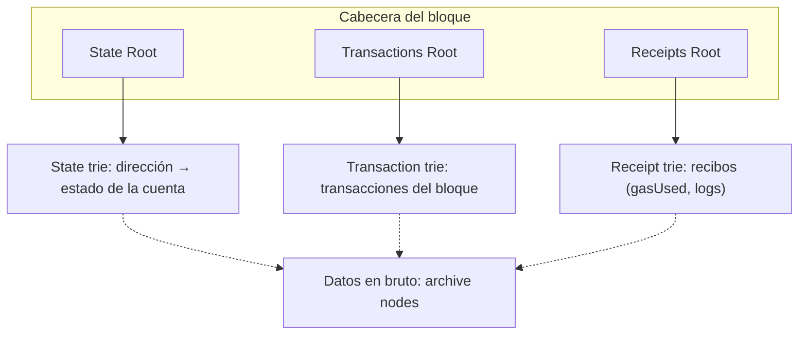
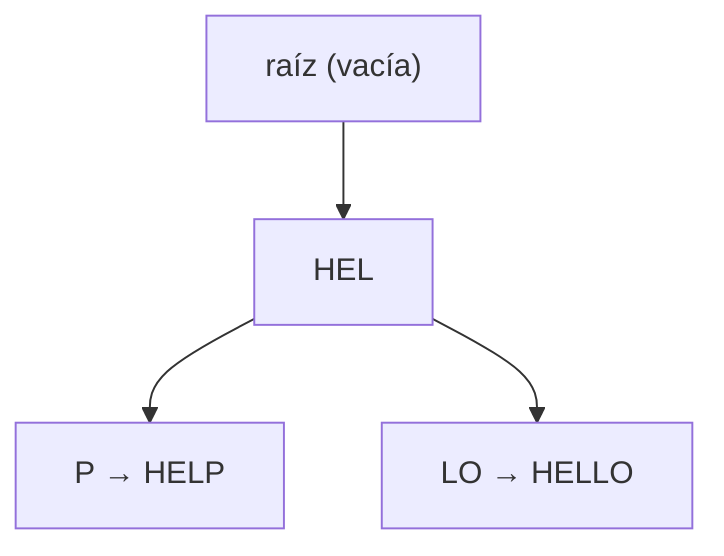
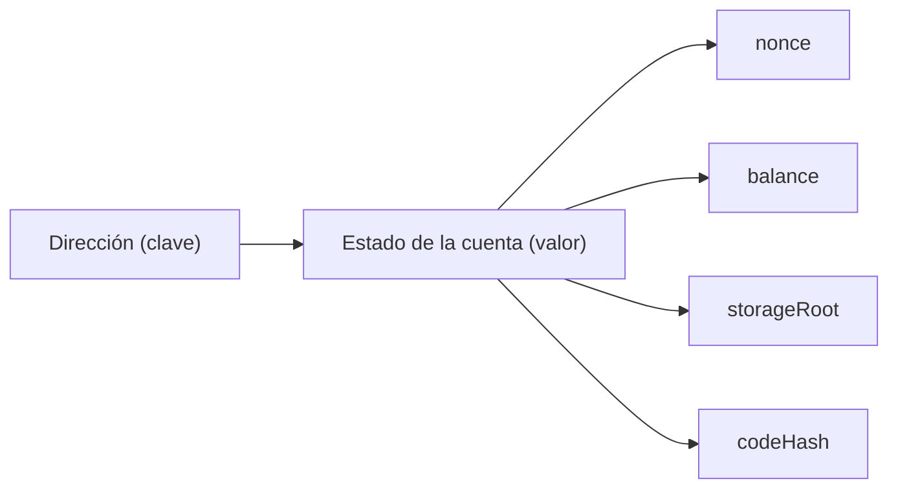

> Los Merkle trees, la Merkle root y las Merkle proofs están en [Merkle Trees](/alchemy-ethereum/blockchain-storage/03-merkle-trees/); el modelo de cuentas de Ethereum, en [UTXO & Account Models](/alchemy-ethereum/blockchain-storage/01-utxo-account-models/).

## TL;DR

- Ethereum usa Merkle trees, pero además un **Patricia Merkle Trie (PMT)**: un **radix trie** combinado con un Merkle tree.
- Un PMT guarda pares clave-valor como una tabla hash, permite verificar la integridad y la inclusión de un par y, a diferencia del Merkle tree, es **eficiente para editar** datos.
- Los datos **permanentes** (transacciones minadas) encajan en Merkle trees; los **efímeros** (estado de las cuentas: nonce, balance…) encajan en PMTs.
- La cabecera de cada bloque de Ethereum incluye tres raíces: **State Root**, **Transactions Root** y **Receipts Root**.
- El objetivo de estas estructuras es optimizar el **espacio** y la **eficiencia de lectura/escritura**.

## Conceptos clave

**Radix trie** (también *Patricia trie* o *radix tree*): estructura en forma de árbol que recupera un valor recorriendo una rama de nodos cuyas claves, juntas, llevan hasta ese valor.

**Patricia Merkle Trie** (PMT): radix trie + Merkle tree. Guarda pares clave-valor y permite verificar su integridad e inclusión, siendo eficiente también al modificar los datos.

**State trie** (*world state trie*): trie que relaciona cada dirección con el estado de su cuenta. Es el estado global de Ethereum y se actualiza con cada transacción ejecutada.

**Transaction trie**: trie con las transacciones del bloque. No se modifica una vez minado el bloque.

**Receipt trie** (*transaction receipt trie*): trie con los recibos (resultados) de las transacciones: `gasUsed`, `logs`… Tampoco cambia tras minar el bloque.

**Datos permanentes y efímeros**: los permanentes no cambian nunca una vez registrados (transacciones); los efímeros cambian constantemente (estado de las cuentas).

## Explicación

### De Bitcoin a Ethereum

Bitcoin popularizó los Merkle trees para incluir transacciones de forma escalable: la `merkleRootHash` basta para comprometer todas las transacciones del bloque. Su arquitectura es sencilla, un libro de registro de transacciones con el modelo UTXO.

Ethereum guarda mucho más **estado**, así que la arquitectura de su bloque es completamente distinta. El bloque contiene referencias a varias estructuras en árbol, y de todas sus propiedades aquí interesan tres: **State Root**, **Transactions Root** y **Receipts Root**, el equivalente en Ethereum a la `merkleRootHash` de Bitcoin.

### Por qué los Merkle trees no bastan

Los Merkle trees son ideales para transacciones: son estáticas y no deben cambiar tras comprometerse, y la raíz las deja «grabadas en piedra». Su objetivo es probar la consistencia de los datos a medida que crece la cadena. En cambio, **no están pensados para editar**: cambiar un registro no es eficiente, algo que con transacciones da igual, pero no con datos que cambian.

### Radix trie

«Trie» viene de *retrieval* (recuperación), que es justo lo que optimiza. Un **radix trie** recupera un valor recorriendo hacia abajo una rama de nodos; cada nodo guarda parte de la clave, y todas juntas llevan al valor final. Al **agrupar las claves que comparten prefijo**, la búsqueda es más eficiente.

PATRICIA es un acrónimo: *Practical Algorithm To Retrieve Information Coded In Alphanumeric*.

### Patricia Merkle Trie

**Patricia trie + Merkle tree = Patricia Merkle Trie** (se pronuncia *tree* o *try*; también se llama *Patricia Merkle Tree*).

- Guarda **pares clave-valor**, como una tabla hash.
- Además, permite **verificar la integridad** de los datos y la **inclusión** de un par clave-valor.
- Agrupa los nodos con valores parecidos: buscar «HELP» recorre el mismo camino que buscar «HELLO», porque comparten las tres primeras letras. Eso ahorra espacio y acelera lecturas y escrituras.
- El nodo raíz puede estar vacío para que el trie admita palabras que empiecen por cualquier letra (por ejemplo, «apple» o «hello» junto a otras que empiezan por «n»).

En resumen, es un Merkle tree «con esteroides»: eficiente para verificar datos y también para editarlos.

### Datos permanentes y efímeros

| | Permanentes | Efímeros |
| --- | --- | --- |
| Ejemplo | Transacciones minadas | Estado de las cuentas (`nonce`, `balance`, `storageRoot`, `codeHash`) |
| ¿Cambian? | No; el registro queda sellado para siempre | Constantemente: recibir ether, interactuar con un contrato… |
| Acceso | El mismo camino en el transaction trie devuelve siempre lo mismo | Se insertan cuentas nuevas y se insertan y borran claves de *storage* a menudo |
| Estructura adecuada | Merkle tree | Patricia Merkle Trie |

Tiene sentido guardarlos por separado, y Ethereum tiene muchos datos efímeros.

> **Nota:** el original no explica los campos de la cuenta. En resumen: el `nonce` es el contador de transacciones enviadas por la cuenta, `balance` su saldo en wei, `storageRoot` la raíz del trie con el almacenamiento de un contrato y `codeHash` el hash de su código.

### La cabecera del bloque

La cabecera del bloque recoge todos los datos del bloque, como el «envoltorio» de todo su contenido (ver [Proof of Work & Mining](/alchemy-ethereum/criptografia/02-proof-of-work-mining/)). En Ethereum incluye, entre otras cosas:

- **State Root**: hash raíz del state trie.
- **Transactions Root**: hash raíz de las transacciones del bloque.
- **Receipts Root**: hash raíz del receipts trie.

> **Nota:** el original dice que la cabecera «es el resultado del hash» de los datos del bloque. Como se comenta en [Blockchain Structure](/alchemy-ethereum/criptografia/04-blockchain-structure/), la cabecera es el conjunto de campos (entre ellos estas raíces) y el hash del bloque es el hash de esa cabecera.

### State trie

Relaciona **direcciones** (clave) con **estados de cuenta** (valor: nonce, balance…). Es un estado global que se actualiza constantemente al ejecutarse transacciones; toda la información de las cuentas está en él y se consulta preguntándole.

Una consulta desde JavaScript al estado global devuelve simplemente un objeto con esos datos. Guardarlos en cada bloque sería demasiado, así que cada bloque solo compromete su **hash raíz**.

### Transaction trie

Registra las transacciones de Ethereum y **no se actualiza nunca** tras minar el bloque. Cada transacción guarda datos propios como `gasPrice` y `value`.

Exploradores como **Etherscan** solo consultan la blockchain y organizan esos datos en un visor. También se puede consultar directamente con **Alchemy Composer** y el método `eth_getTransactionByHash` a partir del hash de una transacción.

### Receipt trie

Registra los **recibos** (resultados) de las transacciones, con datos como `gasUsed` y `logs` (donde están los **eventos** emitidos). Tampoco cambia tras minar el bloque. Se consulta con `eth_getTransactionReceipt`.

### Dónde están los datos

Los tres tries se comprometen en cada bloque mediante su hash raíz; los datos en bruto se guardan en otro sitio, sobre todo en los **archive nodes**. La idea clave: Ethereum usa estas estructuras para optimizar el **espacio** y la **eficiencia de lectura/escritura**.

## Esquema

Las tres raíces de la cabecera de un bloque de Ethereum (sustituye a las imágenes `eth-block` y `eth`; el original muestra más propiedades del bloque que aquí se omiten):

Radix trie con prefijo compartido (sustituye a `pmt`, con el ejemplo «HELP» / «HELLO» del texto):

State trie (sustituye a `state-trie` y `state-example`):

Comparativa de los tres tries:

| Trie | Clave → contenido | ¿Cambia tras minar? | Datos de ejemplo | Método de consulta |
| --- | --- | --- | --- | --- |
| State trie | Dirección → estado de la cuenta | Sí, constantemente | `nonce`, `balance`, `storageRoot`, `codeHash` | — |
| Transaction trie | Transacciones del bloque | No | `gasPrice`, `value` | `eth_getTransactionByHash` |
| Receipt trie | Recibos de las transacciones | No | `gasUsed`, `logs` | `eth_getTransactionReceipt` |

## Glosario

- **Trie**: árbol de recuperación de datos (de *retrieval*).
- **Radix trie / Patricia trie / radix tree**: trie que agrupa las claves con prefijo común.
- **PATRICIA**: *Practical Algorithm To Retrieve Information Coded In Alphanumeric*.
- **Patricia Merkle Trie (PMT)**: radix trie combinado con un Merkle tree.
- **Key-value pair**: par clave-valor.
- **Hash table**: tabla hash, estructura que asocia claves con valores.
- **State Root / Transactions Root / Receipts Root**: hashes raíz de los tres tries, guardados en la cabecera del bloque.
- **World state**: estado global de todas las cuentas de Ethereum.
- **Nonce** (de cuenta): contador de transacciones enviadas por la cuenta.
- **Receipt**: recibo con el resultado de una transacción.
- **Logs**: registros de un recibo; contienen los eventos emitidos.
- **gasPrice / gasUsed**: precio del gas ofrecido y gas consumido por una transacción.
- **Archive node**: nodo que guarda los datos históricos en bruto.
- **Alchemy Composer**: herramienta de Alchemy para lanzar consultas a la blockchain.

## Preguntas de repaso

1. ¿Qué dos estructuras se combinan en un Patricia Merkle Trie y qué aporta cada una?

   

   
Ver respuesta

   Un radix trie (Patricia trie), que agrupa claves con prefijo común para recuperar valores de forma eficiente, y un Merkle tree, que permite verificar la integridad y la inclusión de los datos.

   

2. ¿Por qué Ethereum no usa solo Merkle trees?

   

   
Ver respuesta

   Porque los Merkle trees no son eficientes para editar datos, y el estado de las cuentas de Ethereum cambia constantemente. Los PMTs son eficientes tanto para verificar como para editar.

   

3. ¿Qué diferencia hay entre datos permanentes y efímeros? Pon un ejemplo de cada uno.

   

   
Ver respuesta

   Los permanentes no cambian una vez registrados (una transacción minada); los efímeros cambian a menudo (el estado de una cuenta: nonce, balance…).

   

4. ¿Qué tres raíces incluye la cabecera de un bloque de Ethereum?

   

   
Ver respuesta

   State Root (raíz del state trie), Transactions Root (raíz de las transacciones del bloque) y Receipts Root (raíz del receipts trie).

   

5. ¿Cuáles de los tres tries dejan de cambiar al minar el bloque y dónde están los datos en bruto?

   

   
Ver respuesta

   El transaction trie y el receipt trie. El state trie se actualiza constantemente. Los datos en bruto se guardan fuera del bloque, sobre todo en archive nodes.

   

