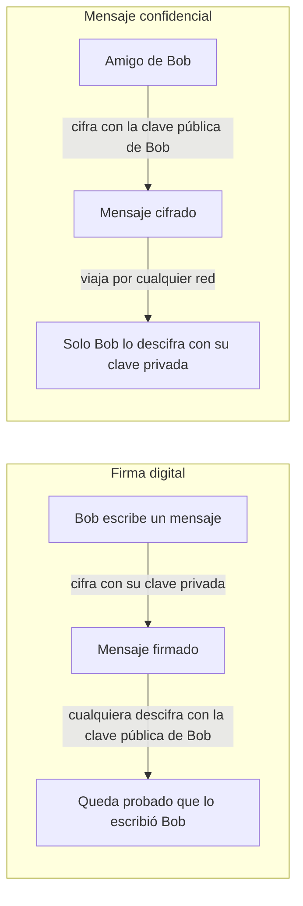

## TL;DR

- Hasta los años 70 la criptografía consistía en cifrar mensajes con una clave secreta que ambas partes compartían (criptografía **simétrica**).
- En 1976 Whitfield Diffie propuso algo contraintuitivo: una **clave pública**, emparejada con una **clave privada** que solo conoce su dueño.
- Cifrar con la clave privada produce una **firma digital** infalsificable; cifrar con la clave pública garantiza que solo el dueño puede leer el mensaje.
- Hoy los algoritmos de clave pública más usados son **RSA** (factorización de primos) y **ECDSA** (curvas elípticas).
- Bitcoin firma con ECDSA sobre la curva **secp256k1**.

## Conceptos clave

**Criptografía simétrica** (*symmetric-key cryptography*): ambas partes usan la misma clave secreta, que deben haber acordado antes de comunicarse.

**Clave pública / clave privada**: par de claves en el que cada una es la única capaz de descifrar lo que ha cifrado la otra. La pública se difunde; la privada solo la tiene su dueño.

**Criptografía asimétrica** (*asymmetric encryption*): nombre que recibe la criptografía de clave pública, porque solo una de las partes tiene acceso a la clave privada.

**Firma digital** (*digital signature*): mensaje cifrado con la clave privada que cualquiera puede descifrar con la clave pública, lo que demuestra quién lo escribió.

**RSA**: algoritmo de clave pública basado en que multiplicar dos primos es fácil, pero recuperarlos a partir del producto es extremadamente difícil.

**ECDSA**: algoritmo de firma digital basado en curvas elípticas; ofrece la misma seguridad con claves más pequeñas.

## Explicación

### La criptografía hasta los años 70

Durante siglos, la criptografía fue el estudio de cómo **cifrar mensajes** para que no pudieran descifrarse aunque se interceptaran. Se usaba sobre todo para transmitir secretos importantes, especialmente en el ámbito militar.

El emisor pasaba su mensaje por una función que producía una salida cifrada. Podía ser algo tan simple como desplazar cada carácter una posición en el alfabeto (`"abc"` → `"bcd"`), una función fácil de romper en cuanto se conoce el truco.

Con el tiempo aparecieron funciones más complejas, y un salto importante fue la **clave secreta**: si las dos partes se reúnen antes de intercambiar mensajes, pueden acordar una clave que, combinada con una función (como el desplazamiento del alfabeto), da un cifrado mucho más seguro. Cuando ambos extremos tienen la clave, se habla de **criptografía simétrica**.

El estado del arte fueron versiones cada vez más complejas de este esquema, y el objetivo era siempre el mismo: que el adversario nunca consiguiera tu clave.

### El problema de la informática personal

Con la llegada de los ordenadores personales, algunos criptógrafos se plantearon un problema nuevo: la gente querría comunicarse de forma segura sin preocuparse de que alguien escuchara (*eavesdroppers*), y quedar en persona para intercambiar claves cada vez parecía anticuado.

La pregunta era: **¿cómo pueden comunicarse de forma segura dos partes que no se han reunido antes para intercambiar claves?**

### La idea de Diffie: una clave pública

En 1976, **Whitfield Diffie** propuso: ¿y si hubiera una clave **pública**? Muchos criptógrafos lo descartaron de entrada, ya que el propósito de una clave era precisamente mantenerla en secreto.

Sin embargo, una clave pública aporta propiedades criptográficas muy importantes. El experimento mental es este: existe una clave privada y una clave pública tales que **cada una es la única que puede descifrar lo cifrado por la otra**. Bob difunde su clave pública como la que lo identifica y guarda en secreto la privada correspondiente.

- **Bob cifra con su clave privada → firma digital.** Cualquiera puede descifrar el mensaje con la clave pública de Bob, y al hacerlo queda demostrado sin lugar a dudas que lo escribió Bob, porque la única clave capaz de cifrarlo es la privada, y solo él la tiene. Es una firma digital infalsificable.
- **Alguien cifra con la clave pública de Bob → confidencialidad.** Cualquiera puede hacerlo, porque la clave es pública, pero **solo Bob** puede descifrarlo. Un amigo de Bob puede enviarle un mensaje por cualquier red, por insegura que sea, con la tranquilidad de que nadie más podrá leerlo.

El problema es que Diffie tenía el concepto, pero **no una función matemática** con esas propiedades. Trabajó con **Martin Hellman** y **Ralph Merkle** buscando un sistema que lo hiciera posible. Lo llamativo del invento es que empezó por el concepto, antes de encontrar las matemáticas que lo sostuvieran.

Frente a las técnicas anteriores, la criptografía de clave pública es **asimétrica**: solo una de las partes tiene acceso a la clave privada.

### RSA y ECDSA

Hoy, los dos algoritmos de clave pública más populares son RSA y ECDSA.

**RSA** se basa en que es muy fácil calcular el producto de dos números primos, pero extremadamente difícil obtener esos dos primos a partir del producto (factorizarlo). Lo difícil que es romper RSA sigue siendo un misterio sin resolver en informática: se asume que solo puede hacerse en **tiempo exponencial** respecto al tamaño de la entrada, lo que en la práctica equivale a un ataque de **fuerza bruta** probando claves al azar. Está relacionado con el problema **P vs NP**.

**ECDSA** usa **curvas elípticas**. Ofrece el mismo nivel de seguridad que otros algoritmos de clave pública con **claves más pequeñas**, y por eso se ha vuelto tan popular. Es el algoritmo de firma digital que usa **Bitcoin**, en concreto con la curva **secp256k1**.

## Esquema

Los dos usos del par de claves de Bob:

| | Simétrica | Asimétrica (clave pública) |
| --- | --- | --- |
| Claves | Una clave secreta compartida | Par: clave pública + clave privada |
| ¿Quién tiene la clave secreta? | Ambas partes | Solo el dueño (la privada) |
| Requisito previo | Acordar la clave antes (p. ej. en persona) | Basta con conocer la clave pública |
| Permite firmas digitales | No | Sí |
| Ejemplos | Desplazamiento de alfabeto con clave | RSA, ECDSA |

| | RSA | ECDSA |
| --- | --- | --- |
| Base matemática | Factorización del producto de dos primos | Curvas elípticas |
| Tamaño de clave | Mayor | Menor para la misma seguridad |
| Uso destacado | — | Bitcoin (curva secp256k1) |

## Glosario

- **Symmetric-key cryptography**: criptografía en la que ambas partes comparten la misma clave secreta.
- **Asymmetric encryption**: cifrado con par de claves pública/privada; solo el dueño tiene la privada.
- **Public key**: clave que se difunde libremente y identifica a su dueño.
- **Private key**: clave que solo conoce su dueño; empareja con la pública.
- **Digital signature**: prueba de autoría obtenida al cifrar con la clave privada.
- **Eavesdropper**: alguien que escucha o intercepta una comunicación ajena.
- **Brute-force attack**: ataque que prueba claves al azar hasta dar con la correcta.
- **RSA**: algoritmo de clave pública basado en la dificultad de factorizar primos.
- **ECDSA** (*Elliptic Curve Digital Signature Algorithm*): algoritmo de firma digital basado en curvas elípticas.
- **secp256k1**: curva elíptica concreta que usa Bitcoin con ECDSA.

## Preguntas de repaso

1. ¿Qué problema intentaba resolver la criptografía de clave pública?

   

   
Ver respuesta

   Cómo pueden comunicarse de forma segura dos partes que no se han reunido antes para intercambiar una clave secreta, algo necesario en la criptografía simétrica.

   

2. Si Bob cifra un mensaje con su clave privada, ¿qué se consigue?

   

   
Ver respuesta

   Una firma digital: cualquiera puede descifrarlo con la clave pública de Bob, y eso demuestra que solo Bob pudo escribirlo, porque solo él tiene la clave privada.

   

3. ¿Y si alguien cifra un mensaje con la clave pública de Bob?

   

   
Ver respuesta

   Solo Bob puede descifrarlo con su clave privada, así que el mensaje puede viajar por cualquier red, aunque sea insegura, sin que nadie más lo lea.

   

4. ¿En qué idea matemática se basa RSA?

   

   
Ver respuesta

   En que multiplicar dos números primos es fácil, pero obtener esos primos a partir de su producto es extremadamente difícil. Se asume que romperlo requiere tiempo exponencial, es decir, fuerza bruta.

   

5. ¿Por qué se ha popularizado ECDSA y dónde se usa?

   

   
Ver respuesta

   Porque ofrece la misma seguridad que otros algoritmos de clave pública con claves más pequeñas. Es el algoritmo de firma de Bitcoin, con la curva secp256k1.

   

