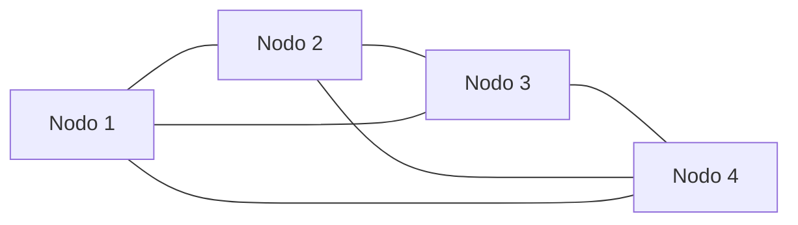
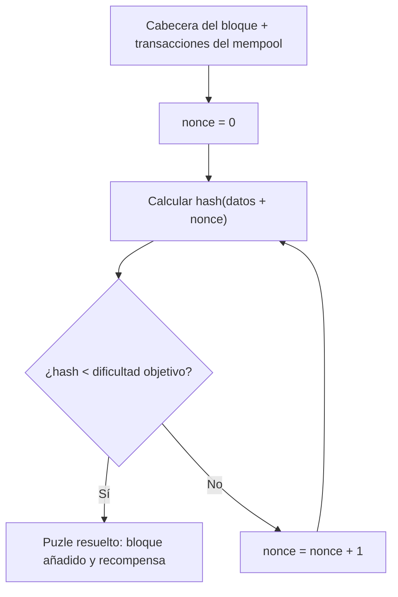

## TL;DR

- Una blockchain es una base de datos distribuida y descentralizada formada por muchos **nodos** que deben ponerse de acuerdo sin ningún actor central.
- Ese acuerdo lo proporciona un **mecanismo de consenso**: un conjunto de reglas que todos los nodos siguen para decidir qué es válido.
- En **proof-of-work** las reglas principales son: no se puede gastar dos veces lo mismo y la cadena válida es la de mayor trabajo acumulado (**consenso de Nakamoto**).
- **Minar** es buscar, variando un **nonce**, un hash del bloque por debajo de una **dificultad objetivo**; encontrarlo prueba que se ha gastado mucho cómputo.
- Los mineros gastan energía y hardware a cambio de una recompensa en moneda. Bitcoin usa proof-of-work; Ethereum lo usaba, pero pasó a proof-of-stake.

## Conceptos clave

**Nodo** (*node*): cada uno de los ordenadores que forman la red de una blockchain.

**Mecanismo de consenso** (*consensus mechanism*): reglas que sigue una red distribuida y descentralizada para mantenerse de acuerdo sobre qué es válido. Son intercambiables: proof-of-work es uno, proof-of-stake otro.

**Proof-of-work**: mecanismo de consenso en el que, para añadir un bloque, hay que presentar una prueba de que se ha gastado trabajo computacional.

**Doble gasto** (*double spend*): gastar las mismas monedas más de una vez; es lo primero que prohíben las reglas de consenso.

**Consenso de Nakamoto** (*Nakamoto Consensus*): regla por la que los nodos aceptan como cadena «verdadera» la más «larga», entendida como la de mayor trabajo acumulado.

**Minado** (*mining*): proceso de crear un bloque de transacciones para añadirlo a la cadena. En proof-of-work, el minado es el «trabajo».

**Dificultad objetivo** (*target difficulty*): umbral que fija el protocolo; el hash del bloque tiene que quedar por debajo de él para ser una prueba válida.

## Explicación

### El problema: ponerse de acuerdo sin un árbitro

Las redes blockchain como Ethereum son, en esencia, bases de datos **distribuidas y descentralizadas** formadas por muchos nodos. En un entorno así surgen tres preguntas:

- ¿Cómo se ponen de acuerdo todos los nodos sobre el estado actual y futuro de los saldos de las cuentas y de las interacciones con contratos?
- ¿Quién puede añadir bloques o transacciones nuevas a la cadena, y cómo sabemos que son «válidos»?
- ¿Cómo se coordina todo esto sin ningún actor central?

La respuesta son los **mecanismos de consenso**.

### Mecanismos de consenso

Consenso significa llegar a un acuerdo general. En una blockchain suele significar que **al menos el 51 % de los nodos** están de acuerdo sobre el estado global actual de la red. Un mecanismo de consenso no es más que el conjunto de reglas que sigue la red para mantener ese acuerdo sobre qué se considera válido. Hay muchos y son intercambiables; proof-of-stake es otro de ellos.

Las reglas principales de proof-of-work son dos:

1. **No se puede hacer doble gasto.**
2. **La cadena «más larga» es la verdadera**: la que el resto de nodos acepta, determinada por el trabajo acumulado de la cadena. Es el **consenso de Nakamoto**.

Bitcoin usa proof-of-work. Ethereum también lo usaba, pero migró a proof-of-stake, que queda fuera de este apunte.

### Proof-of-work

Proof-of-work permite que redes descentralizadas como Bitcoin (y antes Ethereum) se pongan de acuerdo sobre cosas como los saldos de las cuentas y el orden de las transacciones. Así se impide el doble gasto y se garantiza que todos siguen las reglas, lo que hace a estas redes resistentes a ataques. La seguridad viene precisamente de que, para participar, hay que cumplir las reglas de consenso.

En proof-of-work, **el trabajo es el minado**.

### Minado

Minar es el proceso de crear un bloque de transacciones para añadirlo a la blockchain; de hecho, proof-of-work podría llamarse *proof-of-mining*. El nombre es algo engañoso: se popularizó por la analogía con la minería de oro, en la que se gastan energía y recursos a cambio de una recompensa valiosa.

Los **mineros** son los nodos que ejecutan software de minado e intentan continuamente extender la cadena con bloques nuevos que contengan transacciones válidas. Para aceptar un bloque, la red les pide su *proof-of-work*: una salida que caiga en un rango objetivo muy difícil de alcanzar. Una prueba válida en Bitcoin tiene hoy este aspecto:

```text
000000000000000000043f43161dc56a08ffd0727df1516c987f7b187f5194c6
```

El software de minado tiene una sola tarea: tomar unos datos (la cabecera del bloque anterior + las transacciones nuevas) y calcular su **hash**. Si el hash queda por debajo de la dificultad objetivo, el minero ha resuelto el puzle y tiene una prueba de trabajo válida.

### Por qué es tan difícil: los ceros iniciales

Los hashes de **SHA-256** se expresan en hexadecimal, así que cada posición puede tener 16 valores (0-9 y a-f). Por tanto:

- Encontrar un hash que empiece por **un** cero requiere de media **16** intentos.
- Con **dos** ceros iniciales, 16 × 16 = **256** intentos.
- Con **n** ceros, 16ⁿ intentos de media.

La prueba de ejemplo tiene **19 ceros iniciales**, lo que exige de media 16¹⁹ intentos.

> **Nota:** el original da la cifra `75557863725914323419136000000000000000000000` (≈ 7,6 × 10⁴³), pero 16¹⁹ = 75 557 863 725 914 323 419 136 (≈ 7,6 × 10²²). Parece que al original le sobran ceros; la idea (un número de intentos astronómico) no cambia.

Las redes proof-of-work fijan una `target_difficulty`. Es como si la red dijera: «si quieres añadir un bloque, trae una prueba con 12 ceros iniciales». Por cómo funcionan las matemáticas, encontrar una salida tan improbable **es prueba suficiente** de que el minero ha gastado muchos recursos. No hay forma de hacer trampa: o tienes una prueba válida o no la tienes.

### El algoritmo de minado

1. Tomar la cabecera del bloque actual y añadir las transacciones del **mempool** (transacciones pendientes de incluir en un bloque).
2. Añadir un **nonce** (número que se va variando para obtener hashes distintos), empezando en `nonce = 0`.
3. Calcular el hash de los datos de los pasos 1 y 2.
4. Comparar el hash con la dificultad objetivo (la fija el protocolo).
5. Si `hash < target`, el puzle está resuelto y el minero recibe la recompensa.
6. Si no, volver al paso 2 incrementando el nonce.

Los mineros ejecutan este algoritmo continuamente. Mientras la mayoría de nodos siga las reglas de consenso, la blockchain sigue siendo segura y resistente a ataques, y solo se añaden al registro distribuido transacciones válidas y verificadas.

### Incentivo: la recompensa

¿Por qué gastan los mineros energía y hardware en asegurar la red? Porque, a cambio, reciben **moneda como recompensa**. Si se siguen las reglas de consenso y la red es segura, los mineros cobran.

## Esquema

Sustituye a la imagen `blockchain-nodes` del original: una red de nodos sin actor central que comparten la misma cadena.



El algoritmo de minado de proof-of-work:



| Ceros iniciales | Intentos de media |
| --- | --- |
| 1 | 16 |
| 2 | 256 |
| n | 16ⁿ |
| 19 | 16¹⁹ ≈ 7,6 × 10²² |

## Glosario

- **Node**: ordenador que forma parte de la red de una blockchain.
- **Consensus mechanism**: conjunto de reglas con las que una red descentralizada se pone de acuerdo sobre qué es válido.
- **Proof-of-work**: consenso basado en demostrar que se ha gastado trabajo computacional.
- **Proof-of-stake**: otro mecanismo de consenso, al que migró Ethereum (no se trata aquí).
- **Double spend**: gastar las mismas monedas más de una vez.
- **Nakamoto Consensus**: la cadena válida es la de mayor trabajo acumulado.
- **Mining**: crear bloques buscando una prueba de trabajo válida.
- **Miner**: nodo que ejecuta software de minado.
- **Hash**: salida de una función hash; aquí, de SHA-256, en hexadecimal.
- **Target difficulty**: umbral por debajo del cual debe quedar el hash del bloque.
- **Nonce**: número que el minero va incrementando para obtener hashes distintos.
- **Mempool**: conjunto de transacciones pendientes de incluir en un bloque.

## Preguntas de repaso

1. ¿Qué problema resuelven los mecanismos de consenso?

   <details>
   <summary>Ver respuesta</summary>

   Permiten que todos los nodos de una red descentralizada se pongan de acuerdo, sin actor central, sobre el estado (saldos, interacciones con contratos) y sobre quién puede añadir bloques y cuáles son válidos.

   </details>

2. ¿Cuáles son las dos reglas principales de consenso en proof-of-work?

   <details>
   <summary>Ver respuesta</summary>

   No se puede hacer doble gasto, y la cadena verdadera es la más «larga», es decir, la de mayor trabajo acumulado (consenso de Nakamoto).

   </details>

3. ¿Qué tiene que encontrar un minero para añadir un bloque?

   <details>
   <summary>Ver respuesta</summary>

   Un hash de la cabecera del bloque más las transacciones y un nonce que quede por debajo de la dificultad objetivo fijada por el protocolo.

   </details>

4. ¿Cuántos intentos hacen falta de media para un hash con 2 ceros iniciales, y por qué?

   <details>
   <summary>Ver respuesta</summary>

   256, porque cada posición hexadecimal tiene 16 valores posibles: 16 × 16 = 256.

   </details>

5. ¿Por qué los mineros gastan energía y hardware en asegurar la red?

   <details>
   <summary>Ver respuesta</summary>

   Porque a cambio reciben moneda como recompensa cuando minan un bloque válido siguiendo las reglas de consenso.

   </details>
