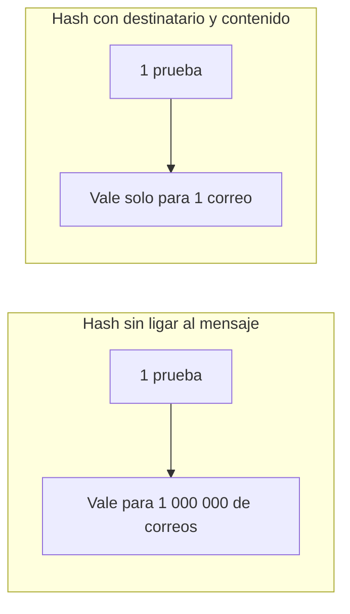

> Este apunte complementa [Proof of Work & Mining](/alchemy-ethereum/criptografia/02-proof-of-work-mining/). El minado, el nonce y la búsqueda de ceros iniciales se explican allí; aquí solo va lo nuevo.

## TL;DR

- Una Proof of Work puede ser tan simple como encontrar una entrada cuyo hash empiece por tres 5; cada carácter más que se exija hace la búsqueda exponencialmente más difícil.
- Bitcoin ajusta la dificultad con más precisión: el hash del bloque debe ser **igual o menor que un hash objetivo**.
- Uno de los primeros usos de Proof of Work fue **frenar el spam**: a un usuario le cuesta un momento, pero a quien envía un millón de correos le cuesta un millón de veces más.
- Para que una prueba no se pueda reutilizar, el hash debe incluir el **destinatario y el contenido** del mensaje.
- Para imponer tu versión de la cadena en Bitcoin necesitarías más del 51 % de la potencia de hash de la red, e incluso así podrías hacer muy poco.

## Conceptos clave

**Hash objetivo** (*target hash*): valor que fija Bitcoin; el hash de un bloque nuevo tiene que ser igual o menor que él. Permite ajustar la dificultad con más precisión que contar caracteres iniciales.

**Proof of Work como antispam**: si cada envío exige una pequeña prueba de trabajo, enviar en masa se vuelve caro en cómputo.

**Hash ligado al mensaje**: la entrada del hash incluye destinatario y contenido, así que cada prueba solo vale para un mensaje concreto.

**Potencia de hash** (*hashing power*): capacidad de cálculo de hashes de un nodo o de toda la red.

**Ataque del 51 %** (*51% attack*): intento de imponer una versión propia de la cadena controlando más del 51 % de la potencia de hash de la red.

## Explicación

### Un reto de ejemplo

Proof of Work es la solución a un reto computacionalmente caro. Por ejemplo, encontrar una entrada cuyo hash SHA-256 empiece por tres 5, algo que solo se consigue probando:

```js
sha256("0"); // 5feceb…
sha256("1"); // 6b86b2…
sha256("2"); // d4735e…
// seguir probando, seguir probando…
sha256("5118"); // 555850…
```

Cuantos más 5 se exijan, más difícil (de forma exponencial) es encontrar la entrada. Bitcoin afina este control fijando un **hash objetivo** (*target hash*): el hash del nuevo bloque tiene que ser **igual o menor** que él.

### Su origen: frenar el spam

Uno de los primeros usos de Proof of Work fue evitar el spam haciendo que cada acción cueste un poco. Si para enviar un correo a tu abuela necesitas un hash que empiece por tres 5, un spammer que quiera escribir a un millón de abuelas necesita un millón de hashes así.

Pero ¿no podría reutilizar el mismo hash para todos los correos? Sí, **a menos que cada hash sea único**. Para eso se exige que la entrada del hash incluya el contenido y la dirección de destino, más un nonce que se va variando:

```js
sha256("Hi Grandma! coolgrandma555@hotmail.com 0"); // f2d9e2…
sha256("Hi Grandma! coolgrandma555@hotmail.com 1"); // 4ee36e…
sha256("Hi Grandma! coolgrandma555@hotmail.com 2"); // c25e5c…
// seguir probando, seguir probando…
sha256("Hi Grandma! coolgrandma555@hotmail.com 424"); // 5552ab…
```

Si se ajusta la dificultad para que cada prueba tarde un minuto, el usuario apenas nota la diferencia, pero a un spammer con una máquina similar le costaría un millón de minutos.

> **Nota:** el original dice que un millón de minutos son «11,5 días», pero en realidad son unos 694 días (casi 2 años). Los 11,5 días corresponden a un millón de **segundos**. La conclusión no cambia: al spammer le sale carísimo.

### Proof of Work como seguridad de Bitcoin

En Bitcoin, Proof of Work es lo que da **seguridad** al sistema. Para dominar la red e imponer tu propia versión de la verdad, necesitarías más potencia de cálculo que todos los demás nodos juntos: el 51 % de la potencia de hash total. Por eso se llama **ataque del 51 %**. Aun consiguiéndolo, lo que se puede hacer es muy limitado, por motivos que tienen que ver con la estructura de datos de la propia blockchain y que el curso trata más adelante.

## Esquema

Por qué el hash debe ir ligado al mensaje:



| | Usuario normal | Spammer |
| --- | --- | --- |
| Correos | 1 | 1 000 000 |
| Pruebas que debe calcular | 1 | 1 000 000 (una por correo) |
| Coste con ~1 min por prueba | ~1 minuto, apenas se nota | ~1 000 000 minutos |

## Glosario

- **Target hash**: en Bitcoin, valor máximo que puede tener el hash de un bloque nuevo.
- **Hashing power**: potencia de cálculo de hashes de un nodo o de toda la red.
- **51% attack**: controlar más de la mitad de la potencia de hash para imponer una versión de la cadena.

## Preguntas de repaso

1. ¿Cómo ajusta Bitcoin la dificultad con más precisión que contando caracteres iniciales?

   <details>
   <summary>Ver respuesta</summary>

   Fija un hash objetivo, y el hash del nuevo bloque tiene que ser igual o menor que él.

   </details>

2. ¿Por qué sirve Proof of Work contra el spam?

   <details>
   <summary>Ver respuesta</summary>

   Porque cada envío exige un pequeño trabajo. A un usuario normal apenas le cuesta, pero quien envía millones de correos tiene que hacer millones de pruebas.

   </details>

3. ¿Cómo se evita que el spammer reutilice el mismo hash para todos los correos?

   <details>
   <summary>Ver respuesta</summary>

   Exigiendo que la entrada del hash incluya el contenido y el destinatario del correo, de modo que cada prueba solo vale para ese mensaje.

   </details>

4. ¿Qué es un ataque del 51 %?

   <details>
   <summary>Ver respuesta</summary>

   Intentar imponer tu propia versión de la cadena controlando más del 51 % de la potencia de hash de la red. Aun consiguiéndolo, lo que se puede hacer es muy limitado.

   </details>
