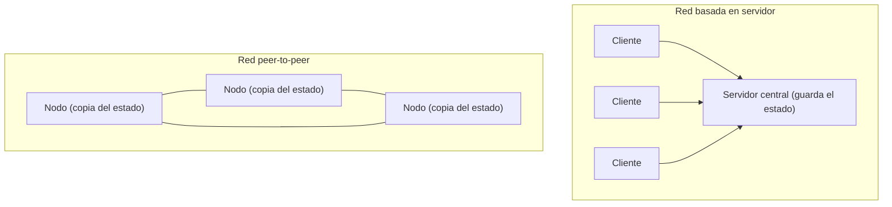
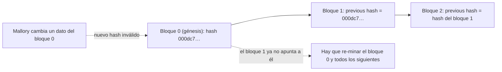

> El nonce, la dificultad y el minado se explican en [Proof of Work & Mining](/alchemy-ethereum/criptografia/02-proof-of-work-mining/); aquí solo se mencionan cuando hace falta.

## TL;DR

- Una blockchain es una base de datos **distribuida** con una lista de bloques validados, en la que cada bloque está ligado criptográficamente al anterior.
- Es una red **peer-to-peer**: no hay servidor ni «supernodo» central, y todos los nodos guardan una copia del estado. Se ponen de acuerdo mediante un mecanismo de consenso.
- Cada bloque tiene índice, marca de tiempo, datos, hash del bloque anterior y nonce. Su **hash** es la huella digital de todo eso junto.
- Si se cambia un dato de un bloque antiguo, cambia su hash, deja de ser válido y rompe el enlace con todos los bloques posteriores. Para arreglarlo habría que re-minar la cadena entera.
- Cada nodo valida cada bloque nuevo propuesto antes de añadirlo a su copia.

## Conceptos clave

**Red peer-to-peer** (*p2p*): red en la que todos los nodos son iguales y cada uno mantiene una copia del estado, sin servidor central.

**Bloque génesis** (*genesis block*): el primer bloque de una blockchain, con índice 0.

**Hash del bloque** (*block hash*): huella digital del contenido del bloque, calculada a partir de todos sus campos.

**Previous hash**: hash del bloque anterior guardado en cada bloque. Es lo que forma la «cadena».

**Integridad de datos** (*data integrity*): garantía de que los datos no se pierden ni se manipulan. En una blockchain la dan los hashes encadenados.

**Validación de bloques**: comprobaciones que hace cada nodo antes de aceptar un bloque nuevo.

## Explicación

### Una base de datos distribuida y peer-to-peer

Una blockchain es una base de datos distribuida formada por una lista de **bloques validados**. Cada bloque contiene datos (transacciones) y está **ligado criptográficamente a su predecesor**, lo que forma la «cadena».

No es solo descentralizada, también es **distribuida**. En informática, un **nodo** es una unidad o miembro de una estructura de datos; en la práctica se puede pensar en él como un ordenador. Los nodos de una blockchain están repartidos por todo el mundo y actúan juntos en tiempo real.

No hay un administrador central (un «supernodo») que verifique los cambios de estado: todos los nodos son miembros iguales, y la red se comporta igual sea cual sea el nodo con el que interactúes. Es decir, las blockchains son **redes peer-to-peer**. En una red basada en servidor, un único servidor central guarda el estado; en una red p2p no existe ese servidor y **todos mantienen una copia** del estado.

¿Cómo se ponen de acuerdo sin un administrador? Con **mecanismos de consenso**. Bitcoin decide qué datos nuevos son válidos según quién consigue producir una proof-of-work válida. Este es un problema clásico de la informática conocido como el **problema de los generales bizantinos** (*Byzantine Generals' Problem*).

### Qué guarda un bloque

El curso lo explica con la demo [blockchaindemo.io](https://blockchaindemo.io/). Una blockchain empieza con un único bloque, el **bloque génesis**, con índice 0 (en informática todo empieza en 0).

| Campo | Qué es |
| --- | --- |
| `index` | Posición del bloque en la cadena. |
| `timestamp` | Momento de creación del bloque, normalmente como **UNIX timestamp** (segundos desde el 1 de enero de 1970). Hace de la blockchain una estructura cronológica. |
| `previous hash` | Hash del bloque anterior. |
| `data` | Datos del bloque; en criptomonedas como Bitcoin, transacciones de dinero. |
| `nonce` | Número que se va cambiando para encontrar un hash válido. |
| `hash` | Huella digital del bloque. Aunque la demo lo muestre como un campo, **no se guarda en el bloque**: se calcula a partir de su contenido. |

> **Nota:** el original dice que al hash se le llama «block hash o block header». En realidad, la cabecera (*block header*) es el conjunto de campos del bloque, y el *block hash* es el hash de esa cabecera; no son lo mismo.

### Cómo se calcula el hash del bloque

Una función hash recibe datos y devuelve un hash único:

```text
f ( data ) = hash
```

Como el hash es la huella de **todo** el bloque, la entrada combina todos sus campos:

```text
f ( index + previous hash + timestamp + data + nonce ) = hash
```

Con los valores del bloque génesis de la demo:

```text
f ( 0 + "0" + 1508270000000 + "Welcome to Blockchain Demo 2.0!" + 604 ) = 000dc75a315c77a1f9c98fb6247d03dd18ac52632d7dc6a9920261d8109b37cf
```

En la demo, un hash es **válido** si empieza por tres ceros; ese número de ceros es la **dificultad**. El minero parte de un bloque candidato con nonce 0 y lo va incrementando hasta dar con un hash válido (en el bloque génesis de la demo, con el nonce 604).

### Integridad de los datos

¿Cómo se garantiza que los datos no se corrompan (que no se pierdan ni se manipulen)? Como los datos forman parte de la entrada del hash, **cambiar un dato cambia el hash del bloque**. El nuevo hash ya no tendrá los ceros iniciales exigidos y el bloque pasa a ser inválido. Manipular un bloque que tiene muchos bloques encima es una misión imposible.

El ejemplo del curso es el primer envío de bitcoins, de Satoshi a Hal Finney (10 BTC). Cambiarlo a 20 BTC exigiría una potencia de cálculo tan inmensa que ni siquiera podemos hacernos una idea.

> **Nota:** el original sitúa esa transacción en el bloque génesis de Bitcoin, pero en realidad está en el bloque 170. El argumento del ejemplo es el mismo.

El escenario, paso a paso, con **Mallory** (el nombre habitual del actor malicioso en criptografía):

1. El hash del bloque génesis de Bitcoin es `000000000019d6689c085ae165831e934ff763ae46a2a6c172b3f1b60a8ce26f`.
2. Mallory cambia un dato y el bloque pasa a tener otro hash: `eb3e5df5eefceb8950e4a444507ce7df1cc534f54a5113f2792ab64830392db0`, que no cumple la dificultad.
3. El bloque 1 apuntaba al hash antiguo del génesis (los enlaces se basan en hashes), así que deja de apuntar a él. El efecto se propaga hasta el final de la cadena.
4. Para seguir, Mallory tendría que minar el bloque manipulado hasta encontrar un hash que cumpla la dificultad de la red en ese momento.
5. Y después **repetir el minado con todos los bloques posteriores**, mientras el resto de mineros sigue añadiendo bloques.

Serían billones y billones de años de cálculo. El ataque fracasa y la integridad de la cadena se mantiene.

### Añadir un bloque nuevo

Un bloque nuevo solo se acepta si cumple estas condiciones:

1. Su índice es el del último bloque + 1.
2. Su `previous hash` es igual al hash del último bloque.
3. Su hash cumple la dificultad.
4. Su hash está bien calculado.

### Quién valida: todos los nodos

Prácticamente **todos los participantes** de la red p2p validan cada bloque nuevo. En una blockchain de 10 nodos interconectados, cuando uno propone un bloque, los demás comprueban que cumple las reglas de consenso. Si las cumple, cada uno lo añade a su propia copia del registro y considera esa cadena la «verdadera», igual que cualquier otro nodo con las mismas reglas. Así logra una red p2p el **consenso descentralizado**.

## Esquema

Red basada en servidor frente a red peer-to-peer (sustituye a las imágenes `bchain_architecture` y `p2p` del original):



Cadena de bloques enlazados por hash, y efecto de manipular el primero:



## Glosario

- **Node**: unidad de una estructura de datos; en la práctica, un ordenador de la red.
- **Peer-to-peer (p2p)**: red de nodos iguales sin servidor central.
- **Supernode**: administrador central hipotético; en una blockchain no existe.
- **Byzantine Generals' Problem**: problema clásico de cómo acordar algo entre participantes sin autoridad central y con posibles traidores.
- **Genesis block**: primer bloque de la cadena, con índice 0.
- **UNIX timestamp**: segundos transcurridos desde el 1 de enero de 1970.
- **Block hash**: huella digital del bloque, calculada a partir de su contenido.
- **Block header**: cabecera del bloque, los campos que se usan para calcular su hash.
- **Previous hash**: hash del bloque anterior, guardado en cada bloque.
- **Candidate block**: bloque que un minero intenta minar.
- **Data integrity**: garantía de que los datos no se pierden ni se manipulan.
- **Mallory**: nombre convencional del atacante malicioso en ejemplos de criptografía.
- **Ledger**: registro, la copia de la cadena que guarda cada nodo.

## Preguntas de repaso

1. ¿Qué diferencia una red peer-to-peer de una red basada en servidor?

   <details>
   <summary>Ver respuesta</summary>

   En la red basada en servidor, un único servidor central guarda el estado. En la p2p no hay servidor central: todos los nodos son iguales y cada uno mantiene una copia del estado.

   </details>

2. ¿Qué campos entran en el cálculo del hash de un bloque?

   <details>
   <summary>Ver respuesta</summary>

   El índice, el hash del bloque anterior, el timestamp, los datos y el nonce.

   </details>

3. ¿Por qué el hash no se guarda en el propio bloque?

   <details>
   <summary>Ver respuesta</summary>

   Porque es una huella digital que se calcula a partir del contenido del bloque; no es un dato más del bloque.

   </details>

4. Si alguien cambia un dato de un bloque antiguo, ¿qué tendría que hacer para que la cadena volviera a ser válida?

   <details>
   <summary>Ver respuesta</summary>

   Volver a minar ese bloque hasta encontrar un hash que cumpla la dificultad y repetir el minado con todos los bloques posteriores, mientras el resto de la red sigue añadiendo bloques. Serían billones de años de cálculo.

   </details>

5. ¿Qué condiciones debe cumplir un bloque nuevo para añadirse a la cadena?

   <details>
   <summary>Ver respuesta</summary>

   Su índice es el del último bloque + 1, su previous hash es igual al hash del último bloque, su hash cumple la dificultad y está bien calculado.

   </details>
