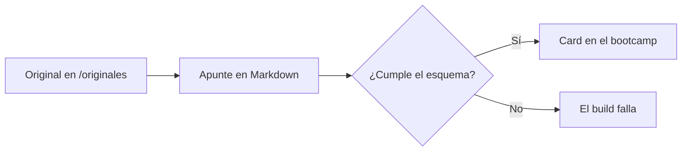

> **Nota:** este es un **apunte de prueba**. Su contenido es relleno y solo sirve para
> comprobar el diseño y el renderizado. Bórralo cuando añadas el primer apunte real.

## TL;DR

- Este apunte existe para probar la web, no para estudiar.
- Incluye todas las secciones del formato definido en el `CLAUDE.md`.
- Tiene un diagrama Mermaid, una tabla, código y respuestas plegables.

## Conceptos clave

**Frontmatter**: bloque YAML al principio del archivo con los metadatos del apunte; se
valida con Zod al hacer el build.

**Mermaid**: lenguaje de texto para describir diagramas que se dibujan en el navegador.

**Details**: elemento HTML que muestra un resumen y oculta el resto hasta que se despliega.

## Explicación

### Cómo se publica un apunte

Cada apunte es un archivo Markdown dentro de `src/content/apuntes/<bootcamp>/<tema>/`.
El número del nombre del archivo marca su orden dentro del tema, y el frontmatter aporta el
título, el resumen y los conceptos que aparecen en la card.

### Qué se comprueba en el build

Si el frontmatter no cumple el esquema, el build falla. También falla si la carpeta del
apunte no coincide con el campo `bootcamp` o si dos apuntes del mismo tema comparten
`orden`.

```ts
// Ejemplo de código resaltado con Shiki
const apunte = { titulo: 'Apunte de prueba', orden: 1 };
console.log(`${apunte.orden}. ${apunte.titulo}`);
```

### Texto largo para probar la lectura

Este párrafo existe para ver cómo se comporta la tipografía en bloques de texto más largos.
La medida de línea debería quedarse por debajo de unos setenta caracteres, con un
interlineado cómodo y un contraste suficiente tanto en modo claro como en modo oscuro. Los
términos técnicos como `nonce`, *gas* o *state root* se mantienen en inglés.

## Esquema



| Sección | Obligatoria | Qué contiene |
| --- | --- | --- |
| TL;DR | Sí | 3-5 viñetas con lo esencial |
| Conceptos clave | Sí | Conceptos en negrita con explicación corta |
| Esquema | Si el tema lo permite | Diagrama Mermaid o tabla |
| Preguntas de repaso | Sí | 3-5 preguntas con respuesta plegable |

## Glosario

- **Build**: proceso que genera el sitio estático a partir del código y los apuntes.
- **Slug**: fragmento de la URL en minúsculas, sin tildes y separado por guiones.

## Preguntas de repaso

1. ¿Qué pasa si el frontmatter de un apunte no cumple el esquema?

   <details>
   <summary>Ver respuesta</summary>

   El build falla y hay que corregir el apunte, no el esquema.

   </details>

2. ¿Qué indica el número al principio del nombre del archivo?

   <details>
   <summary>Ver respuesta</summary>

   El orden del apunte dentro de su tema.

   </details>
